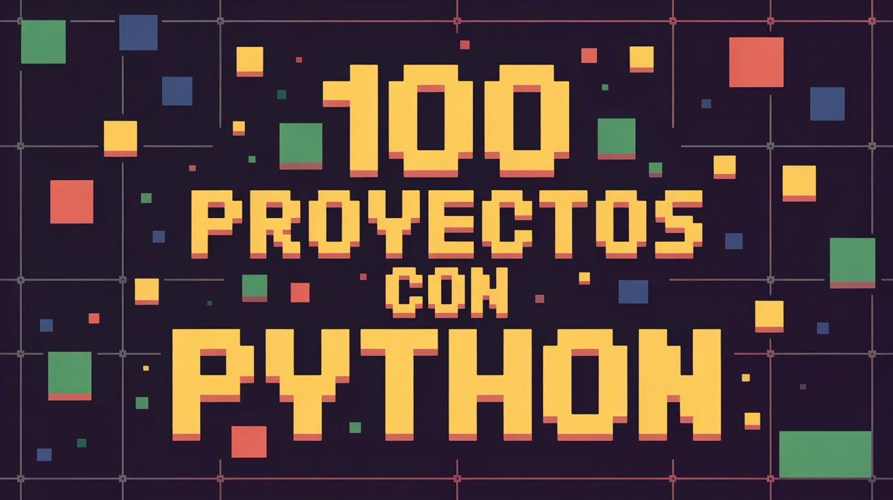

# 🐍🚀 **PYTHON100 – Colección de Proyectos y Scripts** 💻✨

🌟 **Bienvenido a mi laboratorio de desarrollo en Python** 🌟  
Aquí encontrarás una **colección de 100 proyectos y scripts**, que van desde **utilidades prácticas** hasta **juegos interactivos**, pasando por **herramientas de automatización** y **retos lógicos**.  

> 💡 **Objetivo:** Aprender, practicar y perfeccionar habilidades en **Python** mediante proyectos variados que cubren múltiples áreas de programación.

---

## 🔥 **¿QUÉ ENCONTRARÁS EN ESTE REPOSITORIO?**  

✅ **Proyectos sencillos y directos** ⚡ – Pensados para comprender rápidamente su lógica.  
✅ **Scripts útiles para el día a día** 🛠️ – Automatización, conversión de datos y pequeñas herramientas.  
✅ **Ejercicios de lógica y algoritmos** 🧠 – Mejora de razonamiento y resolución de problemas.  
✅ **Juegos y miniaplicaciones** 🎮 – Entretenimiento mientras practicas.  
✅ **Buenas prácticas de código** 📌 – Legibilidad, modularidad y eficiencia.  

🎯 **Este repositorio está en constante expansión**, sumando nuevos proyectos y mejoras para ampliar habilidades.

---

## 🛠️ **TECNOLOGÍAS Y CONCEPTOS UTILIZADOS**  

💻 **Python 3** – Lenguaje versátil para múltiples áreas.  
📂 **Manejo de archivos** – Lectura, escritura y procesamiento de datos.  
📊 **Estructuras de datos** – Listas, diccionarios, conjuntos y más.  
⚙️ **Automatización** – Scripts que ahorran tiempo y trabajo repetitivo.  
🎮 **Programación interactiva** – Juegos en consola y GUI simples.  
🔢 **Algoritmos y lógica** – Búsquedas, ordenamientos, recursividad, etc.  

> 🏆 **Enfoque en código claro, funcional y adaptable a diferentes contextos.**

---

## 🚀 **OBJETIVO DE ESTE REPOSITORIO**  

> 💡 **PYTHON100 es un terreno de pruebas y aprendizaje continuo**, ideal para afianzar bases, explorar nuevas ideas y crear herramientas útiles.  
Cada proyecto es una oportunidad para **mejorar lógica, aprender nuevas librerías y afinar la capacidad de resolver problemas**.

---
